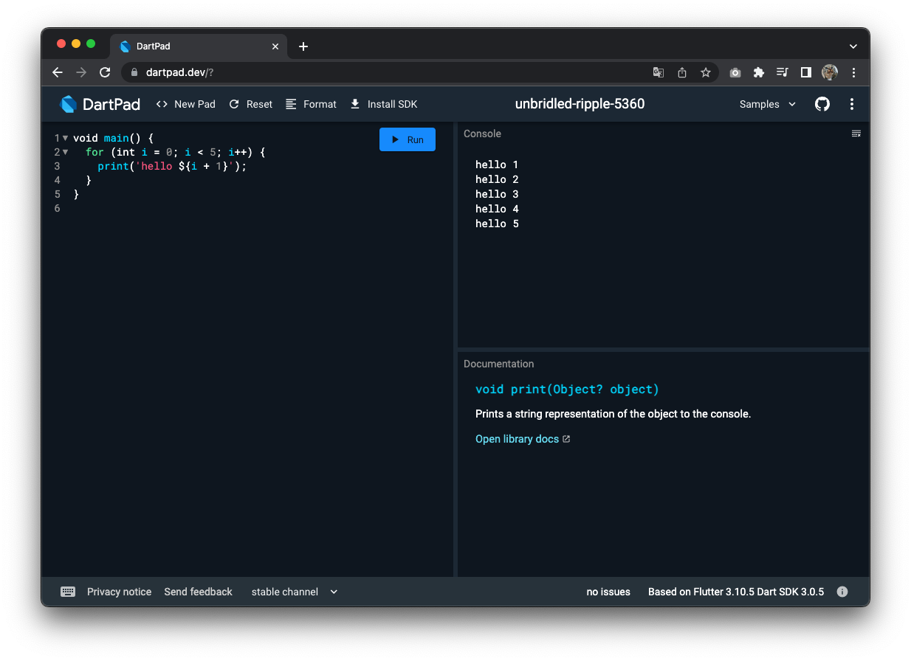

## dart란?
구글에서 만들었으며 모든 플랫폼에서 빠른 앱을 위한 클라이언트 최적화 언어입니다.
- Optimized for UI  
- Productive development  
- Fast on all platforms  
  
from [https://dart.dev/](https://dart.dev/)

## 컴파일러

### Dart Native
dart로 작성된 코드를 여러 CPU의 아키텍쳐에 맞게 변환해주는 컴파일러
- ARM32
- ARM54
- x86_64  
  
개발할 때 Dart VM을 통해 증분 재컴파일(핫 리로드 활성화), 라이브 메트릭 수집( DevTools 지원 ) 및 풍부한 디버깅 지원 기능이 있는 JIT(Just-In-Time 컴파일러)를 제공. 전체 컴파일이 되지 않기 때문에 변경된 작업들을 빠르게 확인 가능
배포할 때에는 Dart VM을 이용하지 않고 AOT(Ahead-Of-Time 컴파일러)를 통해서 각 아키텍쳐에 맞는 기계어로 변환돼서 빠르게 동작. Dart 런타임 환경에서 동작

### Dart Web
dart로 작성된 코드를 javascript로 변환해주는 컴파일러
- JavaScript

  
## dartpad.dev
로컬에 환경 세팅이 안되어 있어도 [https://dartpad.dev/](https://dartpad.dev/)에서 dart 코드를 실행할 수 있음
 
