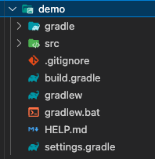

### 목표
spring-boot web app을 로컬에서 띄워보자

# Spring initializr
새로운 spring boot 프로젝트를 구성하기 위해서 https://start.spring.io/ 에 접근한다.  
  
접근하면 사진처럼 spring boot을 init 하기위해서 설정들이 보인다. 아래와 같이 셋팅한다.  
## Config
- Project: Gradle - Groovy (default)  
- Spring Boot: 3.0.5 (default)  
- Project Metadata
  - Group: com.example (default)  
  - Artifact: demo (default)  
  - Name: demo (default)  
  - Description: Demo project for Spring Boot (default)  
  - Package name: com.example.demo (default)  
  - Packaging: Jar (default)  
  - Java: 17 (default)  
- Dependencies
  - Spring Web
  - Thymeleaf 
## Info
참고: https://docs.spring.io/initializr/docs/0.9.x/reference/html/#getting-started-advanced-options  
- Project: 프로젝트 build 관리 tool  
- Spring Boot: 버전.  
  - SNAPSHOT: 최신 변경 사항을 포함하기 위해 매일 밤 빌드 됨 / 버그가 포함될 수 있음  
  - MX: Milestone / 마일스톤에 도달하면 빌드 됨 / SNAPSHOT 과 비슷  
- Project Metadata  
  - Group: 프로젝트 그룹명 / 루트 패키지 이름 (Apache Maven의 속성에서 참조하는 프로젝트 그룹의 ID)  
  - Artifact: 프로젝트 이름 (Apache Maven의 속성에서 참조하는 아티팩트의 ID)  
  - Name: Spring Boot 애플리케이션의 이름을 결정하는 프로젝트의 표시 이름 / Ex) ```my-app``` -> ```MyAppApplication```클래스 생성  
  - Description: 프로젝트 설명  
  - Package name: 프로젝트의 루트 패키지. 지정하지 않으면 Group 속성의 값이 사용됨  
  - Packaging: 프로젝트 패키징 타입 / 압축 결과물 확장자  
  - Java: 사용할 자바 버전  
- Dependencies
  - Spring Web - Web 어플리케이션을 위한 라이브러리가 포함되어있다. Apache Tomcat이 기본으로 embedded container 형식으로 내장되어 있음.
  - Thymeleaf - 웹을 위한 서버 사이드 자바 템플릿 엔진. 정적 HTML 화면을 구현할 수 있다.
  
## Project 다운로드  
 
하단의 ```GENERATE``` 버튼을 클릭하여 다운로드 한다.  
demo.zip 파일로 다운로드가 되고 압축해제를 하면 아래 사진과 같은 구조로 구성이 되어있다.
 
# 실행  
visual studio code 환경에서 ```gradle for java``` 플러그인을 설치했으면 아래 사진과 같이 버튼으로 간단하게 gradle 실행이 가능하다.  
 
실행하고 나서 브라우저를 통해서 접근을 해보면 spring error 페이지가 반겨준다.  
(기본적으로 http://localhost:8080 를 요청하면 된다.)
 
이유는 ```/``` 경로에 대해서 return 하는 페이지가 없기 때문이다.
# Page 만들기
## 'Hello World' Page
- hello world는 국룰(?)  
  
공식 document https://spring.io/quickstart 를 참고하여 특정 경로로 요청했을때 string 값을 return 할 수 있도록 구성해본다.
#### src/main/java/com/example/demo/DemoApplication.java
```
package com.example.demo;

import org.springframework.boot.SpringApplication;
import org.springframework.boot.autoconfigure.SpringBootApplication;
import org.springframework.web.bind.annotation.GetMapping;
import org.springframework.web.bind.annotation.RequestParam;
import org.springframework.web.bind.annotation.RestController;

@SpringBootApplication
@RestController
public class DemoApplication {

	public static void main(String[] args) {
		SpringApplication.run(DemoApplication.class, args);
	}
    @GetMapping("/hello")
    public String hello(@RequestParam(value = "name", defaultValue = "World") String name) {
      return String.format("Hello %s!", name);
    }
}
```
```/hello``` 경로로 요청했을때 Hello World가 표시가 되도록 짜여진 코드이다.  
다시 스프링을 실행하여 브라우저에서 http://127.0.0.1:8080/hello 경로를 요청하면 Hello World 가 잘 표시되는걸 확인할 수 있다.
  
  